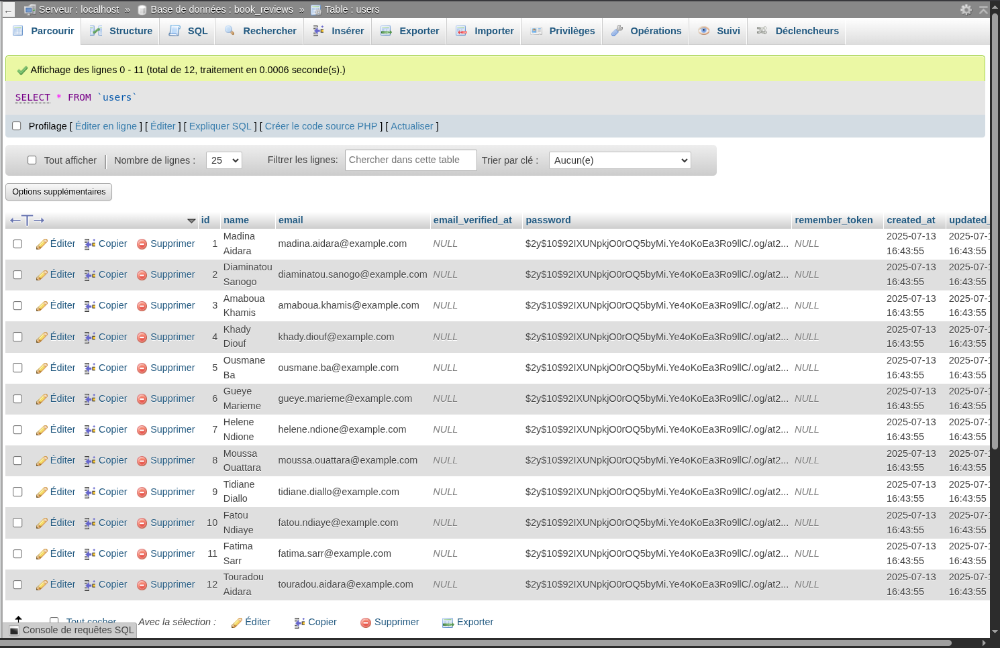

# Application de Gestion de Livres et Avis - Laravel (Book Reviews)

---

## Présentation du projet

Cette application Laravel permet de gérer une bibliothèque virtuelle où les utilisateurs peuvent consulter une liste de livres, voir les détails de chaque livre, ainsi que consulter, ajouter, modifier et supprimer des avis avec une note (1 à 5 étoiles). L'interface est claire, accessible et responsive, avec un design inspiré des ambiances de bibliothèque. 

---

## Fonctionnalités principales

- Affichage de la liste des livres avec couverture, titre, auteur et note moyenne.
- Recherche de livres par titre.
- Page détails d’un livre avec présentation complète, liste paginée des avis et formulaire d’ajout d’avis.
- Modification et suppression des avis existants par les utilisateurs.
- Affichage dynamique des notes moyennes ; affichage "pas encore de note" si aucun avis.
- Pagination des avis sur la page détail.
- Page d’accueil personnalisée.
- Page 404 personnalisée avec lien vers la liste des livres.
- Styles personnalisés rappelant l’ambiance bibliothèque avec images de fond.

---

## Prérequis

- PHP >= 8.1
- Composer
- Serveur web (ex: Apache, Nginx) ou serveur intégré Laravel (`php artisan serve`)
- Système de gestion de base de données compatible MySQL/MariaDB
- Node.js & npm (optionnel si compilation assets frontend)

---

## Installation détaillée

### 1. Cloner le dépôt

    git clone https://github.com/diams45588/Books_reviews.git
    cd Books_reviews

### 2. Installer les dépendances PHP avec Composer

    composer install

### 3. Configurer l’environnement

Copier le fichier `.env.example` en `.env` :

    cp .env.example .env

Modifier le fichier `.env` pour configurer la connexion à la base de données :

DB_CONNECTION=mysql
DB_HOST=127.0.0.1
DB_PORT=3306
DB_DATABASE=nom_de_votre_base
DB_USERNAME=votre_utilisateur
DB_PASSWORD=mot_de_passe

### 4. Générer la clé d’application

    php artisan key:generate

### 5. Créer la base de données

Créer la base de données spécifiée dans `.env` via phpMyAdmin, MySQL CLI ou outil dédié dans mon cas c'est MySQL:

    CREATE DATABASE nom_de_votre_base;

### 6. Exécuter les migrations et seeders

Appliquer les migrations pour créer les tables :

    php artisan migrate

Exécuter les seeders pour injecter les données initiales (livres et utilisateurs) :

    php artisan db:seed

### 7. Lancer le serveur de développement

    php artisan serve

L’application sera accessible par défaut sur [http://127.0.0.1:8000](http://127.0.0.1:8000)

---

## Structure du projet

- `app/Models` : Contient les modèles Eloquent `Book`, `Review` et `User` avec leurs relations.
- `app/Http/Controllers` : Contient les contrôleurs `BookController` pour la gestion des livres et `ReviewController` pour les avis.
- `resources/views` : Vues Blade structurant le front-end.
  - `layouts/app.blade.php` : Layout principal avec le style global.
  - `books/index.blade.php` : Liste des livres affichée avec couverture, titre, auteur et note.
  - `books/show.blade.php` : Page détails d’un livre avec avis et formulaire d’ajout.
  - `reviews/edit.blade.php` : Formulaire d’édition d’un avis.
  - `welcome.blade.php` : Page d’accueil personnalisée.
  - `errors/404.blade.php` : Page 404 personnalisée.
- `database/migrations` : Migrations définissant les tables `books`, `reviews`, `users`.
- `database/seeders` : Seeders pour remplir la base avec des livres et utilisateurs de test.
- `routes/web.php` : Définition des routes web et endpoints.

---

## Utilisation

- Accéder à la page d’accueil : `/` (page d’introduction).
- Consulter la liste des livres : `/books` (affichage avec couverture, titre, auteur, note).
- Rechercher un livre par titre : `/books/search`.
- Visualiser détails d’un livre : `/books/{id}`.
- Ajouter un avis sur la page détail d’un livre.
- Modifier ou supprimer un avis existant via les liens sur la page détail.
- Pagination dynamique des avis.
- Accès aux pages inexistantes affiche la page 404 personnalisée.

---

## Personnalisation

- Le style est basé sur des couleurs et images rappelant l’ambiance calme des bibliothèques.
- Les images de couverture sont stockées dans `public/images/covers`.
- Le système peut être étendu avec authentification, upload PDF, recherche avancée, etc.

---

## Dépendances principales

- Laravel Framework 10.x
- PHP 8.1+
- Pagination et routing natifs Laravel
- Pas de framework CSS externe, design custom en CSS pur

---

## Remarques

- La pagination des avis est configurée pour 5 avis par page.
- Les avis peuvent être ajoutés, modifiés et supprimés sans authentification dans cette version.

---

# Description des tables

### 1. Table `books`

| Champ       | Type      | Description                                      |
|-------------|-----------|--------------------------------------------------|
| id          | bigint    | Identifiant unique du livre (clé primaire).      |
| title       | string    | Titre du livre.                                  |
| author      | string    | Auteur du livre.                                 |
| description | text      | Description du livre.                            |
| published_at| date      | Date de publication du livre.                    |
| cover_image | string    | Nom du fichier image de couverture.              |
| created_at  | timestamp | Date et heure de création du livre.              |
| updated_at  | timestamp | Date et heure de la dernière mise à jour.        |

---

### 2. Table `reviews`

| Champ       | Type      | Description                                                  |
|-------------|-----------|--------------------------------------------------------------|
| id          | bigint    | Identifiant unique de l'avis (clé primaire).                 |
| book_id     | bigint    | Identifiant du livre (clé étrangère vers `books`).           |
| user_id     | bigint    | Identifiant de l'utilisateur (clé étrangère vers `users`).   |
| rating      | integer   | Note donnée au livre (1 à 5).                                |
| comment     | text      | Commentaire de l'utilisateur sur le livre.                   |
| created_at  | timestamp | Date et heure de création de l'avis.                         |
| updated_at  | timestamp | Date et heure de la dernière mise à jour.                    |

---

### 3. Table `users`

| Champ       | Type      | Description                                         |
|-------------|-----------|-----------------------------------------------------|
| id          | bigint    | Identifiant unique de l'utilisateur (clé primaire). |
| name        | string    | Nom de l'utilisateur.                               |
| email       | string    | Adresse e-mail de l'utilisateur (unique).          |
| password    | string    | Mot de passe de l'utilisateur.                     |
| created_at  | timestamp | Date et heure de création de l'utilisateur.        |
| updated_at  | timestamp | Date et heure de la dernière mise à jour.          |

---

# Captures d'écrans 

## Page d'accueil

## Liste des livres

## Détail du livre

## Ajouter un avis

## Avis ajouter 

## Modifier un avis

## Supprimer un avis

## Page 404

## Base de données

## Table utilisateurs

## Support et contribution

N’hésitez pas à faire remonter des bugs ou suggestions via issues GitHub, ou à proposer vos améliorations via pull requests.
